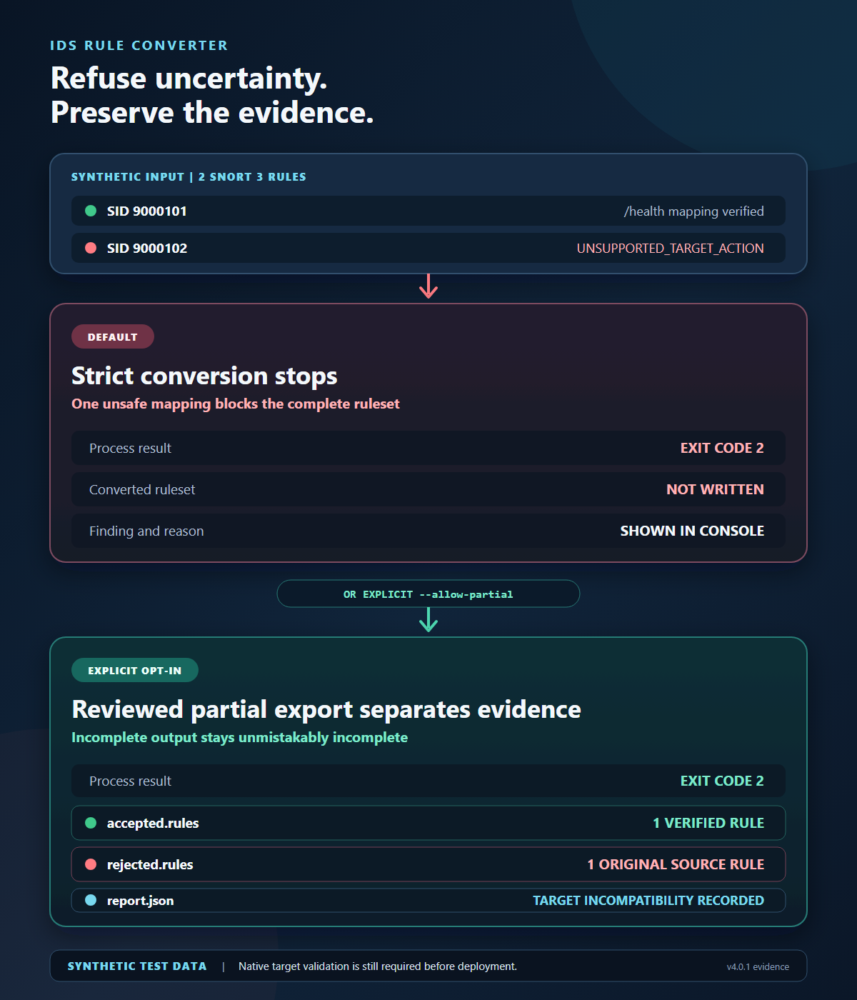

# IDS Rule Converter

[](https://github.com/fusiontechstrategies/IDS-Rule-Converter/actions/workflows/ci.yml)
[](https://github.com/fusiontechstrategies/IDS-Rule-Converter/actions/workflows/engine-validation.yml)
[](https://github.com/fusiontechstrategies/IDS-Rule-Converter/actions/workflows/security.yml)
[](LICENSE)

Stop guessing whether a converted IDS rule still means the same thing.

IDS Rule Converter is a secure, loss-aware, one-file Python toolkit for parsing,
validating, analyzing, comparing, and converting Snort and Suricata rules. It
defaults to refusing uncertain translations instead of silently dropping or
weakening detection logic.

The runtime has no third-party Python dependencies. Copy
`snort_suricata_rule_converter.py` to a system with Python 3.10 or newer and run
it directly.

Version 4.0.2 is the current release. Download the verified
[standalone Python runtime](https://github.com/fusiontechstrategies/IDS-Rule-Converter/releases/download/v4.0.2/IDS-Rule-Converter-v4.0.2.py)
or the deterministic
[documentation ZIP](https://github.com/fusiontechstrategies/IDS-Rule-Converter/releases/download/v4.0.2/IDS-Rule-Converter-v4.0.2.zip).
The [release page](https://github.com/fusiontechstrategies/IDS-Rule-Converter/releases/tag/v4.0.2)
also provides a Python wheel and source archive, the SPDX SBOM, SHA-256 checksums, release evidence, and GitHub
provenance. See [RELEASING.md](RELEASING.md) for the exact artifact and
publication gates.

For an installed command, use the [PyPI 4.0.2 package](https://pypi.org/project/ids-rule-converter/4.0.2/):

```text
python -m pip install ids-rule-converter==4.0.2
ids-rule-converter --help
```

## Why this tool is different

Rule conversion is not a keyword replacement problem. Sticky buffers, content
modifier placement, service declarations, application protocols, regular
expressions, and engine-specific actions all affect detection behavior.

IDS Rule Converter provides:

- Ordered parsing that preserves repeated options and content modifier context
- Strict, fail-safe conversion between Snort 2, Snort 3, and Suricata 8
- Explicit rejection files and machine-readable reports for unsafe rules
- Native JSON and SARIF output for automation and code scanning systems
- Duplicate SID, conflicting SID, keyword, protocol, and action analysis
- Semantic ruleset comparison by GID, SID, revision, and fingerprint
- Offline Panorama IPS Signature Converter 2.0.4 compatibility preflight
- Safe download support for allowlisted Cisco Talos community feeds
- Archive defenses against traversal, links, special files, duplicate paths,
  encrypted ZIP entries, Windows device names, and decompression abuse
- Atomic output writes, overwrite refusal, and input replacement protection
- No telemetry and no implicit network access

## Quick start

```text
python snort_suricata_rule_converter.py --help
python snort_suricata_rule_converter.py validate input.rules
python snort_suricata_rule_converter.py analyze input.rules --output analysis.json
```

Convert a Snort 3 ruleset to Suricata. Strict mode is the default, so no ruleset
is written if any rule has an unsafe or unverified mapping.

```text
python snort_suricata_rule_converter.py convert input.rules --source-dialect snort3 --target suricata --output converted.rules --report conversion.json
```

To export only the verified subset, preserve every rejected source rule, and
receive a detailed report:

```text
python snort_suricata_rule_converter.py convert input.rules --source-dialect snort3 --target suricata --output accepted.rules --allow-partial --rejected-output rejected.rules --report conversion.json
```

An intentional partial result exits with code 2 so automation cannot mistake it
for a complete conversion.

Reviewed partial conversion writes the current rejection file even when its
count is zero. Primary/rejection comments and the JSON report share a generation
ID; the report binds the intended UTF-8 artifacts by SHA-256. Verify those hashes
before consuming the files. Each leaf is published atomically, but publication
of the three files is not a single transaction.

### Strict and reviewed partial results



Constructed test data. Strict mode writes no converted ruleset when one mapping
is unsafe. An explicit partial export preserves accepted rules, rejected source
rules, and the report as one review set. Native target validation is still
required.

## Commands

| Command | Purpose |
| --- | --- |
| `validate` | Parse rules and report structural or identifier problems |
| `analyze` | Inventory rules, keywords, actions, protocols, duplicates, and conflicts |
| `convert` | Convert to Snort 2, Snort 3, Suricata, or structured JSON |
| `panorama-preflight` | Check and batch rules for Panorama plugin 2.0.4 |
| `diff` | Compare two rulesets by GID and SID |
| `list-sources` | Show built-in HTTPS feed definitions |
| `fetch` | Download and optionally extract an allowlisted rule feed safely |

See [QUICK_REFERENCE.md](QUICK_REFERENCE.md) for copy-ready examples.

## Conversion safety model

Auto detection rejects legacy buffer placement when the same text can mean a
Snort 2 backward content modifier or a Snort 3 forward sticky buffer. Use
`--source-dialect snort2` or `--source-dialect snort3` after identifying the
source engine. The tool does not guess which payload or HTTP buffer a pattern
should inspect. Panorama preflight also rejects these ambiguous rules.

Even with an explicit Snort 2 source, a backward buffer modifier must be
associated with its preceding content. A modifier separated by `flow`,
`metadata`, or another unrelated option is rejected for Snort 3 and Suricata,
including with `--allow-unverified`. It is never reinterpreted as a forward
selector for a later pattern.

Non-rule text after a closed rule on the same logical line is a parse error.
The complete prefix is withheld, so conversion and Panorama cannot publish
an artifact that silently drops trailing conditions. Separate complete rules
on one line remain supported; standalone directives on separate lines are
still reported as ignored text.

Snort 3 `file_id` supports its documented one-token header only. Protocol,
address, port or direction fields on that action are refused by the parser and
all public manual-rule/rendering/JSON paths. Ordinary network and service headers
retain their existing grammar.

Processing is bounded to 128 MiB per input, 1 MiB per rule, 256 options per
rule, 100,000 parsed rules, 1,000,000 total options, and 10,000 diagnostics.
Exceeding any parser budget aborts the operation, including with
`--allow-partial`, so a truncated prefix cannot be mistaken for a complete
ruleset. Archive object limits include implicit directories, with at most
32 path components. Console and text reports escape embedded control
characters; JSON retains the original values for review. Fingerprints preserve
content and PCRE literal whitespace rather than collapsing it.

Release verification binds package descriptions, authors, project URLs,
classifiers, README content, and the wheel generator to the reviewed source.
Source archives reject unreviewed empty directories and nonportable paths.
PyPI promotion verifies the copied distribution hashes and rechecks the tag,
signed commit, main ancestry, and public stable release after environment
approval. Python 3.10 development checks use the pinned `tomli` compatibility
parser; the runtime CLI still uses only the standard library.

The default behavior is intentionally conservative:

1. The complete input must parse successfully.
2. Each rule is checked against the declared target dialect.
3. Verified transformations preserve option order and buffer context.
4. A rule with an unsafe mapping is rejected, not approximated.
5. Strict conversion writes nothing when any rule is rejected.
6. Partial conversion requires both a rejection file and a JSON report.
7. Unknown target keywords require the explicit `--allow-unverified` opt-out.

Important verified transformations include Snort 3 and Suricata HTTP sticky
buffers, Snort 2 HTTP content modifiers, safe service mappings, TLS protocol
naming, selected SIP options, `bufferlen` to `bsize`, `stream_size` syntax,
fast-pattern offsets, and compatible tag syntax.

The converter rejects ambiguous multi-service rules, unsupported target actions,
conflicting application protocols, unsafe buffer arguments, packet and
application-layer conflicts, unsupported BER and DCE options, and other cases
where equivalence has not been established.

Always run the target engine's native configuration test before deployment.
Successful parsing proves that an engine accepts a rule. It does not prove that
every rule will detect identical traffic under every engine configuration.

## Panorama preflight

Explicit Suricata input keeps legacy HTTP content modifiers attached to the
preceding content when converting to Snort 3. Later payload matches restore
their payload buffer. Mixed sticky selectors and backward HTTP modifiers,
orphan modifiers, and cursor-dependent translations without a proven mapping
are rejected even with `--allow-unverified`. Suricata's underscore aliases for
forward selectors, such as `http_protocol`, remain distinct from backward HTTP
modifiers. See the [Suricata HTTP syntax reference](https://docs.suricata.io/en/suricata-7.0.12/rules/http-keywords.html)
and [Snort 3 HTTP selectors](https://docs.snort.org/rules/options/payload/http/).
Automatic dialect inference also rejects mixed underscore forward aliases and
backward HTTP groups; choose a source dialect only after inspecting the input.
The Suricata buffers `dns_query`, `http_header_names`, `http_host`,
`http_protocol`, `http_raw_host`, `http_server_body` and `http_user_agent`
(including dotted forms) have no proven Snort target mapping and are refused
even with `--allow-unverified`. Native Snort 3 validation identified these
unsupported selector names; this tool does not guess at a substitute field.

Panorama case checks track `file_data` and explicit payload-buffer transitions
for both content and PCRE. A file-data match requesting `nocase` is rejected
under the plugin's fixed case-sensitive file-data compatibility model; a
case-sensitive file-data match can pass the remaining checks. This is an
offline compatibility model, not execution against a Panorama appliance.

The Panorama command performs an offline compatibility review for IPS Signature
Converter plugin 2.0.4. It checks documented action, protocol, condition, PCRE,
threshold, reference, case-sensitivity, negation, and positional limits. Accepted
source rules are divided into batches of no more than 100 rules and 8 MB.

```text
python snort_suricata_rule_converter.py panorama-preflight input.rules --output-dir panorama-review
```

The tool never connects to Panorama and never uploads a rule.

## Safe feed retrieval

Network access occurs only when `fetch` is explicitly invoked. Built-in sources
use HTTPS and an exact hostname allowlist. Redirects outside that allowlist are
refused.

```text
python snort_suricata_rule_converter.py list-sources
python snort_suricata_rule_converter.py fetch --source snort3-community --output-dir downloads --extract
```

The downloaded archive, SHA-256 metadata, and extracted files are local outputs.
Rules remain subject to their provider's terms and are not part of this project's
Apache 2.0 license.

Fetch supervises a fresh Python spawn worker under one 30-second deadline,
including DNS, connect, TLS, redirects, headers, body and byte-only IPC. On failure
or interruption it cancels and reaps the worker. Operating-system process
creation/termination latency remains outside the application deadline. Library
callers must use normal import-safe guarded process startup; frozen executables
and interactive embedding are not supported by this fetch supervisor. It trusts
the installed interpreter, module and caller startup; it does not use isolated
Python mode or execute selected feed code.
On the main thread, a callable SIGINT handler is deferred during process and
reader startup until both have been adopted for cleanup, then restored and
invoked. Its original returning or raising behavior is preserved. Calls on other
threads and ignored/default OS signal dispositions are unchanged. Arbitrary
asynchronous exceptions and forced OS termination are outside this cleanup
guarantee.

Extraction returns paths beneath a new `generation-<id>` directory after every
member has decoded successfully. The fetch metadata lists those completed paths.
ZIP file entities are independently counted and checksummed through complete
stored/raw-deflate input with bounded chunks before the standard extraction writer.
This changes the earlier direct-member output layout. Each call, including
`force=True`, preserves earlier generations and user files; it never overwrites
them. Unsupported atomic no-replace directory publication is refused. Failed
staging cleanup is limited to that newly created private generation and may
require owner review if its identity or contents no longer match.

TAR PAX metadata is parsed under a separate object policy before member handling.
Each extension admits at most 16 fields, each read pass admits at most 4,096 PAX
fields in total, keywords have a 128-byte limit, and UTF-8 values have a 4,096-byte
limit. Integer and decimal timestamp fields use a small bounded numeric grammar.
Each pass also permits at most 100,000 effective field applications, including
repeated global metadata and local overrides; a valid archive can therefore be
refused below the ordinary member-count limit when it uses more metadata.
The existing compressed/decompressed, extension-byte/chain, member, filesystem
object, path, file-size and total extraction limits still apply.

Local PAX supports `path`, `linkpath`, `size`, `uid`, `gid`, `uname`, `gname`,
`mtime`, `atime`, `ctime`, `hdrcharset` and `comment`. Global PAX supports only
the owner, time, charset and comment fields; global `path`, `linkpath` and `size`
are refused. Charset metadata must specify `ISO-IR 10646 2000 UTF-8`. Its exact
raw byte range is checked before slicing or decoding the charset value, after
the existing length bound. Binary PAX, unknown vendor fields and every GNU sparse
PAX variant are refused before value decoding or sparse-map parsing. Links,
special files and legacy sparse members remain unsupported. Ordinary USTAR/GNU
names and common POSIX UTF-8 long paths
and fractional timestamps remain supported within these limits.
Empty numeric fields are refused rather than coerced to zero; empty paths still
fail path admission. Empty owner/comment strings remain text metadata. This is
a bounded subset of PAX, not support for every POSIX metadata convention. Live
feed metadata compatibility is not attested by these offline controls.

Where the standard library exposes `_fromtarfile`, PAX following headers use
its `dircheck=False` extension protocol. This suppresses legacy `AREGTYPE`
trailing-slash directory inference from a fallback header name before an
effective local PAX path is applied. Older parsers use their existing public
`fromtarfile` protocol and retain that legacy inference; this fallback-name edge
is not supported there. These protocols do not establish compatibility with
every future standard-library version or provider metadata convention.

The TAR validator returns immutable `AdmittedTarMember` records with only
`name`, `type`, `size`, `isfile()` and `isdir()`. It no longer returns full
`TarInfo` objects or extension dictionaries. Both admission and decoding keep
the standard-library member cache empty between streaming reads. No arbitrary
TAR metadata is used to change filesystem ownership, timestamps or permissions.
Windows extraction roots must be a private child below a drive anchor; the drive
anchor itself is refused, including aliases that present a directory as an anchor.

Feed metadata records a SHA-256 digest of both the configured URL and the complete
effective redirect target, including parameters and query order, without the
fragment (which is not sent to the server). Display URLs redact parameters and
queries so authentication tokens do not enter the metadata. Compare the digests
when checking whether two downloads used the same target.

## Python library use and input provenance

Pass the entire parse result when converting a ruleset:

```python
from pathlib import Path
from snort_suricata_rule_converter import RuleParser, convert_rules

parsed = RuleParser().parse_file(Path("input.rules"))
converted = convert_rules(parsed, "suricata", source_dialect="snort3")
if converted.errors:
    raise ValueError("Review the diagnostics before using any converted rules")
```

Any parse error rejects the complete conversion, including a valid prefix before
an invalid later record. Parser-produced rules retain their complete parse
diagnostics when their nonempty list is copied or sliced. The `ParseResult`
also retains diagnostics when a failed parse produces no rules. Empty sequences
have no parse provenance and are refused; use the complete parser-produced
`ParseResult` for a valid empty input. Manually constructed `Rule`
objects require `allow_detached_rules=True` and produce a provenance warning.
The same acknowledgement is required when calling `render_rule` or
`rule_to_dict` directly with a manual `Rule`. Direct rendering, per-rule JSON,
batch conversion and Panorama admission all refuse errors retained from the
complete parse, even if public diagnostics were cleared. An acknowledgement
never overrides a known parse failure or a target compatibility error.
That option acknowledges the caller's responsibility for the original input; it
never overrides a known parse failure or unsafe semantic mapping. Direct option
transformers also refuse constraints they cannot preserve.

File input snapshots record the SHA-256 of the exact consumed bytes, including a
UTF-8 BOM and original line endings. JSON, SARIF, conversion comments, Panorama
reports/manifests and diff reports retain that digest. On Windows, a retained
read handle excludes data writers, writable mappings and deletion during the
read. Existing writable handles are refused; close editors that hold one and
retry. This does not lock the file after parsing or establish who authored it.

File admission retains lexical no-follow directory handles or descriptors and
opens the leaf relative to that retained parent. User-selected symlinks, junctions,
parent traversal and writable/untrusted ancestry are refused. Ordinary regular
local files and Windows short-name spellings remain supported. Windows snapshots
require a local drive path; UNC and device namespaces are not supported. Only the
existing root-owned macOS `/var` and `/tmp` aliases receive the documented system
alias treatment. No existing ownership or permission repair is performed.

Direct rendering and batch conversion share source-dialect admission: `None` and
`auto` infer the dialect; incompatible legacy buffer ambiguity requires an
explicit `snort2`, `snort3`, or `suricata` choice. Unknown strings are refused.
Canonical JSON can describe an ambiguous rule, but does not authorize deploying it.
Option-only transformation helpers require a concrete source dialect.

Fast-pattern chopping is validated within its associated content group. Both the
documented pair-only Snort form and a pair with an optional bare `fast_pattern`
produce exactly one Suricata `fast_pattern:offset,length`. The offset is 0-65535,
the length is 1-65535, and the nonempty chop must fit the supported content bytes.
Duplicate markers, orphan pairs, unknown byte escapes and widened-content chops
are refused. See the primary [Snort fast-pattern guide](https://docs.snort.org/rules/options/payload/fast_pattern)
and [Suricata prefilter guide](https://docs.suricata.io/en/suricata-8.0.1/rules/prefilter-keywords.html).
Raw NUL is refused at public text admission and rule/text output boundaries,
including acknowledged manual rules; quoted hex `|00|` remains ordinary rule syntax.

## Test evidence

Panorama checks normalize equivalent dotted and legacy buffer selectors before
applying compatibility policy. Raw HTTP header, host and URI selectors are
rejected under either spelling. Supported normalized HTTP buffers remain
available; native Panorama validation is still required before deployment.

The 4.0.1 release-readiness tree contains 64 automated tests covering parsing,
conversion, reports, Panorama checks, overwrite controls, URL and redirect
policy, malicious archives, repository text policy, and deterministic release
construction. CI exercises Python 3.10 through 3.14 on Linux, Python 3.12 on
Windows and macOS, and both conversion directions against pinned Snort 3.10.0.0
and Suricata 8.0.6 containers.

The larger 4,017-rule Cisco Talos community corpus was validated for version
4.0.0. Snort accepted the full same-dialect round trip with zero warnings. The
fail-safe Suricata conversion accepted 3,762 rules, rejected 255 with recorded
reasons, and passed native validation with zero errors. Suricata emitted 71
nonfatal duplicate-buffer warnings for source patterns that intentionally revisit
an earlier sticky buffer.

Version 4.0.1 changes output-file race handling, feed URL validation, repository
controls, and release construction. It does not change conversion semantics. The
large third-party corpus has not been rerun for the candidate, so its result is
kept explicitly separate from the current hosted native-fixture checks. Full
commands, container digests, and scope are recorded in
[docs/TESTING.md](docs/TESTING.md).

## Exit codes

| Code | Meaning |
| --- | --- |
| `0` | Operation completed without blocking findings |
| `1` | Operational failure, unsafe path, network failure, or invalid invocation |
| `2` | Validation findings, conflicts, rejected rules, or an intentional partial result |
| `130` | Interrupted by the operator |

## Development

```text
python -m pip install -r requirements-dev.txt
python -m ruff format --check .
python -m ruff check .
python -m bandit -q -r snort_suricata_rule_converter.py scripts
python -m pip_audit -r requirements-dev.txt
python -m unittest discover -s tests -v
```

The production runtime remains one file. Tests, documentation, and repository
automation are separate so the executable itself stays portable.

## Security and privacy

- Rule files are processed locally.
- The tool contains no credentials, tokens, account IDs, or environment-specific
  resource names.
- Output files are UTF-8 and written atomically.
- Existing outputs are refused unless `--force` is supplied.
- `--force` cannot replace an input file.
- Report suspected vulnerabilities through the private process in
  [SECURITY.md](SECURITY.md).

## License

The converter, tests, and project documentation are licensed under the Apache
License 2.0. Third-party rules, vendor documents, and downloaded feeds are not
redistributed by this repository and retain their original terms.

Snort is a registered trademark of Cisco. Suricata is a registered trademark of
the Open Information Security Foundation. This project is independent and is not
endorsed by either organization.

### Immutable publication prerequisite

Further PyPI promotion requires a public stable GitHub release whose REST API
reports `immutable: true`. GitHub locks that release's tag and assets, closing
the tag-mutation window between sequential authorization queries. Existing
mutable releases are rejected rather than silently grandfathered in. Enable
immutable releases before publishing the next fully assembled draft, following
[GitHub's immutable release workflow](https://docs.github.com/en/code-security/concepts/supply-chain-security/immutable-releases).
The final job checks release identity and stable/public flags again after
approval. GitHub still permits prerelease metadata changes; these flags are
verified snapshots, not an atomic transaction spanning GitHub and PyPI.
